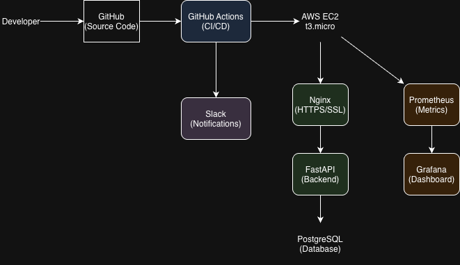

# Fitlio — Sports Facility Management SaaS



## Overview
A production-grade SaaS platform for managing sports facilities, built with modern DevOps practices.

## Tech Stack
| Category | Technology |
|----------|-----------|
| Backend | FastAPI + PostgreSQL |
| Container | Docker + Docker Compose |
| IaC | Terraform |
| Cloud | AWS EC2 (t3.micro, ap-southeast-2) |
| Web Server | Nginx + Let's Encrypt (HTTPS) |
| CI/CD | GitHub Actions |
| Monitoring | Prometheus + Grafana + Node Exporter |
| Notification | Slack Webhook |
| Security | Trivy (0 vulnerabilities) |

## Architecture
- Developer pushes code → GitHub Actions runs tests → Deploys to AWS EC2
- Nginx handles HTTPS termination → FastAPI serves API → PostgreSQL stores data
- Prometheus scrapes metrics → Grafana visualizes dashboards
- Slack receives deployment notifications (success/failure)

## Key Features
- ✅ HTTPS with Let's Encrypt SSL
- ✅ Automated CI/CD pipeline (test → deploy → notify)
- ✅ Real-time monitoring dashboard
- ✅ Infrastructure as Code (Terraform)
- ✅ Zero hardcoded secrets (.env + GitHub Secrets)
- ✅ Security scanning (Trivy — 0 CRITICAL, 0 HIGH)
- ✅ Slack deployment notifications

## Live Demo
🌐 https://fitlio-jay.duckdns.org

## CI/CD Pipeline


## Monitoring
- **Prometheus**: http://fitlio-jay.duckdns.org:9090
- **Grafana**: http://fitlio-jay.duckdns.org:3000

## Security
- Secrets managed via `.env` (gitignored) + GitHub Secrets
- Trivy vulnerability scan: **0 CRITICAL, 0 HIGH, 0 MEDIUM**
- IAM: Least privilege principle (no root access)

## Local Development
```bash
git clone git@github.com:jayjuhoonchoi/fitlio.git
cd fitlio
cp .env.example .env  # fill in your values
docker compose up
```